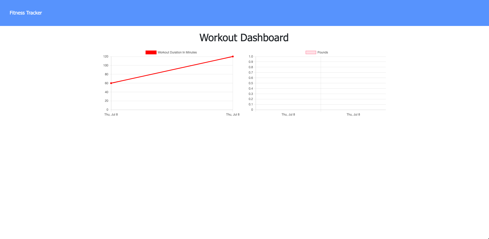

# Workout Tracker

 
 

## **Description**
* An app that allows users to track their workouts and compair thier progress over time.
 
 

## **Table of Contents**
- [Installation](#Installation)  
- [Usage](#Usage)  
- [License](#License)  
- [Contributing](#Contributing)  
- [Tests](#Tests)  
- [Questions](#Questions)  
 
 

## **Installation**
* Use Heroku.
 
 

## **Usage**
* To make it easier to keep track of your workouts.
 
 

## **License**
### *MIT*  
        A short and simple permissive license with conditions only requiring preservation of copyright and license notices. Licensed works, modifications, and larger works may be distributed under different terms and without source code.
 

## **Contributing**
* No contributions at this time.
 
 

## **Tests**
    
* npm run test 
 
 

## **Questions**
* GitHub: https://github.com/KevinHenleyCode

* For more questions you can reach me at my Email:(kevinhenleyinfo@gmail.com)

 
 

## **Screenshot**

 
 

## **Links**
[Site](https://secure-caverns-72925.herokuapp.com/?id=60e77d0067e469001509d116)
